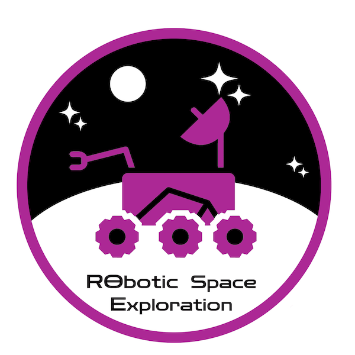

## Fear

Javascript has always been one of those languages that kind of scared me off when I first started to pursue a degree in Computer Science. 

I was initially so averse to the idea of creating websites (especially when I was exposed to HTML in middle school which especially scared me off), but after gaining some experience so far in my Software Development course as well as some extra experience in my Robotics and Space Exploration club, I've begun to be more and more appreciative of its capabilities and usefulness in programming.

## Careful Approach

My first exposure to being required to learn Javascript was at the beginning of my Fall 2023 semester when I decided to join the Robotics and Space Exploration (RoSE) club at UH Manoa. I was interested in gaining more coding experience, especially because I had hardly any prior, and decided it would be an interesting club to join to learn more about coding and how it relates to physical machinery. After getting settled with the Guidance and Navigation Control team (essentially the coding team for RoSE), I was placed on a ground station subteam that ran a central website built for the robot's communications built with full-stack web development in Javascript with a bit of HTML and CSS. 

I was completely new to Javascript and working in a coding team in general, which was the first time I ever made my own GitHub account. For approximately 3 weeks, I had to self-teach the basics of Javascript, HTML, CSS, Github, and the React framework and bootstrap. This was a very challenging and daunting task, but I have slowly been getting used to it as time has gone by and have ended up successfully creating a working product that is used in the ground station network.

## Confidence

As I entered the Software Development class at UH Manoa, known as ICS 314, I went in somewhat confident considering how I already had a basic grasp on Javascript as a language, but not even 1 week in I found myself learning new things and climbing the ladder of knowledge alongside the rest of my classmates. One example of such would be ES6 and the use of arrow commands. Before this class, I was very confused as to arrow commands and how they function, much less how to use them in an actual program, but only 2 weeks in I have gained a better grasp on them than I had all last semester at RoSE.

ICS 314 is helping me learn much more than in the realm of Javascript, however, the practice WODs (Workout of the Day) that we have worked on so far have tested my ability to problem solve under a time limit and apply that solution to runnable code. While the time limit is quite stressful, I think it does a good job of strengthening my ability to work under pressure as well as come up with creative solutions to problems in a faster manner than before, and I'm sure that this will continue as the semester progresses and harder WOD's will be assigned to us students. 

## Fathom

Overall, I'm looking forward to what I will be able to learn and achieve in my ICS 314 class this Spring 2024 semester, and this personal portfolio this will be centered on is the perfect example of such. Learning Javascript has become a joy for me as I find some comforts in working with the language that I do not find in other coding languages such as Java or C++ (especially the fact that Javascript has no types). I can't wait to see how it will turn out in the end and what knowledge from this course I will be able to apply in the future.
