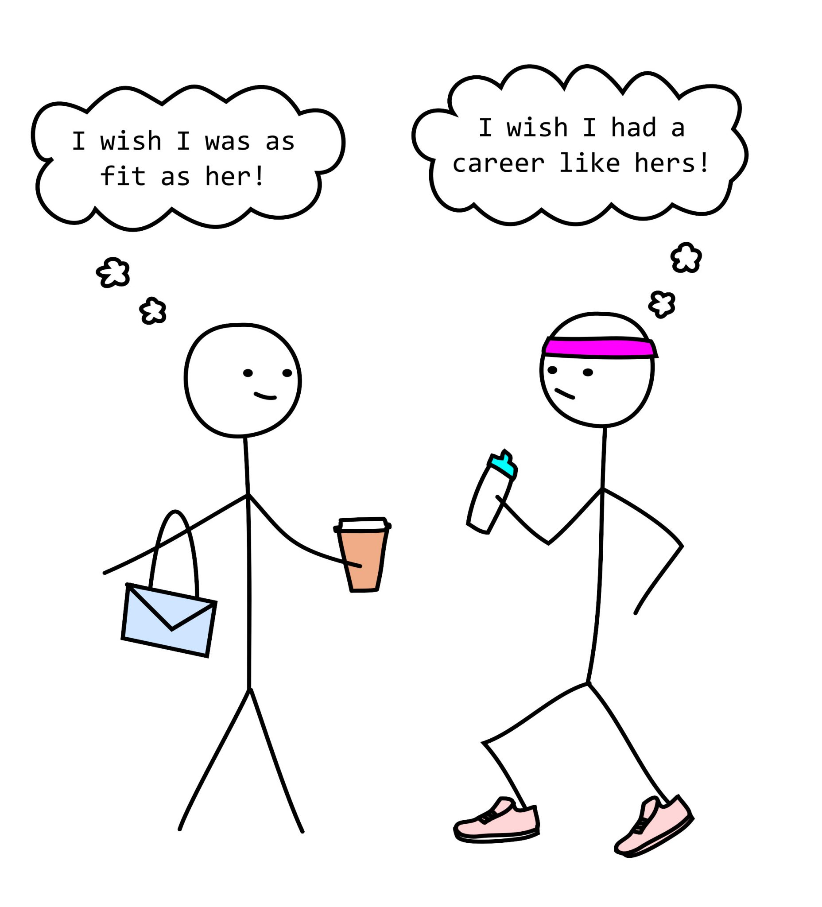

## Lack of Direction

When I was a senior in high school, I would always hear my friends and classmates talk about what college they were applying to, what career they hoped to have in the future, and what they were doing right then in their lives to achieve it. Whenever I'd hear this I would always be so lost with what *I* wanted to do in the future. With a large lack of motivation for anything in particular and the need to feel like I can accomplish something in life, I set off for the closest community college after graduation and began my journey as an... economics major?

I had never really been that into economics in particular, and that notion was solidified in my very first semester of college at the University of Hawaii at Maui College when I took the Intro to Microeconomics course. To this day, I don't think there has been a class I have enjoyed partaking in less than that. After this semester I began truly trying to consider what I wanted to do in the future when all of a sudden one day it hit me: I should do computer science. I have always loved playing video games and being on the computer, so why not make that hobby into something I can build my life upon? "The tech industry is getting larger anyway" is what I always thought to myself to keep me motivated, but after a few years in the field, it became apparent that there are *many* others out there with the same idea.

## The Thief of Joy

Because of the large number of students also trying to pursue a career in computer science in recent years, the level of competition regarding colleagues in my field has *vastly* grown
to a point where I always feel that I am behind. This was never more clear than in my first few semesters transferring to UH Manoa to pursue a BS in Computer Science. The very first semester after I transferred, I ended up dropping out of my one and only ICS course, ICS 212, for that semester because of how behind I was and the massive lack of knowledge and experience regarding anything to do with computer programming, and the next semester I didn't even take any classes at all due to a lack of funding for my tuition at the time.

At this point, I was at the end of my 2nd year in college and have gotten nowhere with my degree and nowhere with my experience with software engineering or programming of any kind. Although I felt compelled at the time to give up and cut my losses where they were and continue the stable job I had in food service, I knew I would not be happy living this way for the rest of my life, so I finally decided to grasp at my life and make a change.

## Upward Progress

Starting in the Spring semester of 2023, I made it a point to do everything I could to catch up to my peers regarding my experience with software engineering. Before the semester even started, I knew I would struggle with ICS 212 as I had dropped out of it previously, so I spent around 40 total hours teaching myself Java and the basics of Object Oriented Programming to make sure that the course would go by easier than the last attempt. Sure enough, this was successful and I ended up with an A- in the class at the end. 

This continued into my Fall 2023 semester to an even greater extent, as I decided to join 3 separate extra-curricular activities to bolster my experience with software engineering even more. I joined the Guidance and Navigation Controls team for a robotics team known as RoSE, I joined the student-led club known as PANDA to help refine my programming and algorithm knowledge, and I joined the Game Dev Club to combine my hobby of video games with my field of computer science. These activities alongside the ICS courses I was taking that semester have made me feel much more empowered with respect to my knowledge and capabilities in software engineering, and I'm sure that as the semesters go by, my progress with integrating myself and standing out in this field will get closer and closer to my goal of launching into a career in computer science.
