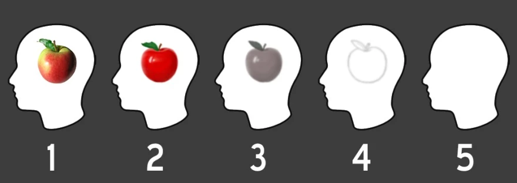
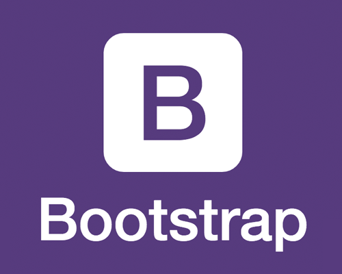

## The Mystery of My Mind

The section in my ICS 314 course at UH Manoa focusing on UI frameworks has been the most difficult section of an ICS class I have ever taken so far. To be fair, this was previously mentioned by the professor to be the most difficult part of the class, but I have been struggling with this kind of concept way before this and my entire upbringing. I currently "suffer" (in quotations because it isn't a particularly debilitating condition) from level 5 aphantasia. For those that do not know what aphantasia is, essentially I have difficulty picturing things in my mind. Such difficulty, in fact, that I do not picture anything at all. Everything that goes through my head is essentially in the form of a thought or description and skips the process of forming imagery entirely. My brain functions as normal despite this, for the most part, but it has made anything to do with visual arts or design a struggle throughout my life, and I am certainly experiencing this during this section.

## Pushing Past the Roadblock

Despite this, I have been trying my best to keep up with all of the work and expectations of me so far in the course and have been getting along the best I can. It helps me a lot not to think of the code I am writing as drawing or designing what a website would look like, but instead similar to software engineering where all my code has a purpose and try to understand what each line does in a vacuum rather than relying on what I see on the screen for a result. For example, instead of thinking "ah if I use 'd-flex' and 'justify-content-center' it will center an image, I mostly think of the result I want to achieve and how the code I write brings that result, similar to how when you make a calculator app using terminal UI, its less about what you see and more about understanding what each part of the code does and the result it brings. It is hard to explain because I cannot conceptualize what it is like for the "normal" person to picture things and the thought processes behind such things, but this is the best I can do.

## Looking Forward

I have never really thought of myself as someone who will ever be a front-end developer of any sort. The challenges that my condition brings me when it comes to visual stimuli make it harder than necessary, so instead of trying to force myself against the tide, I've accepted that moving forward I will try to pursue and perfect the things I am good at instead. I cannot say this section on website designing and UI frameworks has been fun, because it has not, but I understand it is an important tool for a software developer to have so I will do and learn what is necessary to ensure a secure future career in the field. As of writing this, my class is going to be moving into the React framework from Bootstrap 5 and raw HTML/CSS, which I fear will be an even larger struggle, but I shall persevere through it nonetheless.
