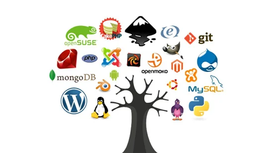

## Initial First Impressions

ICS 314 at UH Manoa was the first (and so far only) Software Engineering course I took in my college journey as a Computer Science major, and going into it I honestly had no idea what to expect. Everyone throws around the term "Software Engineering" to a point where I feel like it is simply used as a general blanket term for any Computer Scientist who creates things to do with software. To an extent, I guess this is accurate, but what I never expected to learn throughout the course was about the actual practices and ethics that come with working with others on a team or with developer tools like Meteor or ChatGPT (for those who use it). I thought it was just going to be a course where we were told to make a website or a program and that's all it would be since people seemed to think that the class was easy and simple and just a necessary course to get through on the pathway to a degree at UH Manoa, but it turned out to teach me much more.

## Unexpected Newfound Knowledge

I think one of the main topics we went over in this ICS 314 course at UH Manoa that will end up sticking with me for the rest of my time as a developer is the coding standards and styles that developers use to keep code neat and readable. Ever since around halfway through the course, I've noticed that I have been instinctually formatting my code according to the coding standards that are required of us in the ICS 314 course, even in outside projects that have nothing to do with the course at all or even the same language or purpose. I have been adding a single new line to the end of files on all my code, keeping proper indentation, using single quotes for strings, etc. It has made my code look much nicer and more readable overall since, so I'm quite happy with this new "instinct" of mine.

I also greatly appreciate all the knowledge and experience I have gained with agile project management and open-source software development through the Final Project assigned to our class for the semester. In case you, the reader, have not seen it on the list of my projects on the front page of my github.io website, our final project for ICS 314 was to get into groups and follow development patterns to ultimately create a mock website of our choosing. Nonetheless, through this, I have learned about the usefulness of dividing up work with other members of a project in order to quickly and efficiently manage the workload, as well as how useful taking snippets of code or templates from open-source software can be. For the latter point, it should be noted that our group's final project page was initially made using a Meteor website template created by two of the professors of ICS 314 this semester, Professor Johnson and Professor Moore.

## Final Takeaways of ICS 314

As of this being written, I am currently concluding my status as a student of this ICS 314 course with this very essay, which is part of the overall final "exam". While I came into this course not expecting much except for software development dirty work like website and program creation, I have left with a much broader understanding of the Software Engineering field and how much more goes into it other than just writing good code, and if there's anything that this final project taught me, it's that it takes more than just writing good code to be successful on a project. It's also thinking about the ethical choices behind working on projects and writing code, how to work well and efficiently with others on a team (thank you GitHub for making this so much easier), why coding standards exist and how they help other developers to comprehend your code and keep it neat, and so on and so forth. I hope to keep these good habits and experiences along with me as I move forward into my future career, even if it doesn't include any programming at all.
