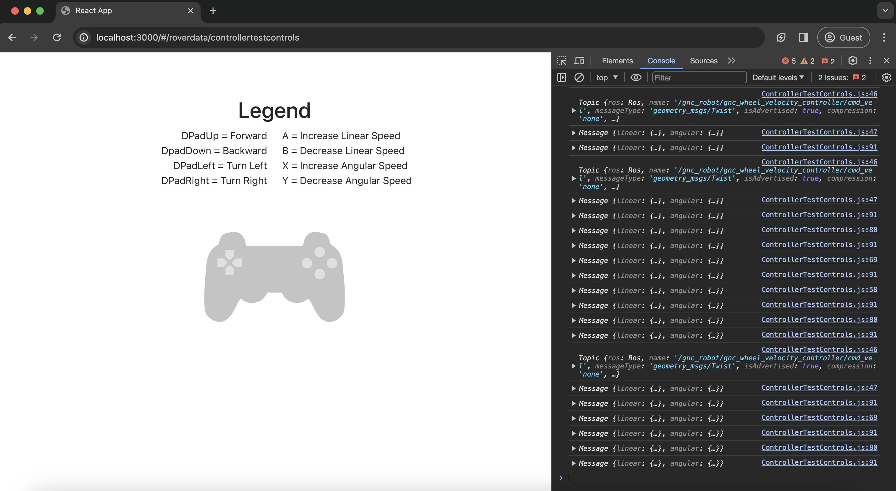

The controller navigation system is a webpage I created as a part of the Robotics and Space Exploration's Ground Station team that translates input from the controller into movement commands sent to the robot we are using.

This website was mostly implemented through the [React](https://react.dev/) framework and written using Javascript for the commands, both of which I gained much experience in through self-teaching methods to catch up to the rest of the team.

Most of the communications through this webpage made to the robot itself are done through the middleware [ROS](https://www.ros.org/), which is meant to integrate the mechanical controls of the robot with the instructions sent to it through a ground control center built with software.

I also began my very first experiences with [Github](https://github.com/) and [IntelliJ IDEA](https://www.jetbrains.com/idea/) through this team, and have become competent with their use in projects and working with others. 

Here is some example code to illustrate the controller's use and how it communicates to the robot through ROS:

```
/////////////////////////
// Movement control
/////////////////////////
    function forward() {
        message = new window.ROSLIB.Message({
            linear: { x: linSpeed, y: 0, z: 0, },
            angular: { x: 0, y: 0, z: 0, },
        })

        console.log(cmd_vel);
        console.log(message);
        //Call velocity topic from ROS connection
        cmd_vel.publish(message);
    };

    function backward() {
        message = new window.ROSLIB.Message({
            linear: { x: -linSpeed, y: 0, z: 0, },
            angular: { x: 0, y: 0, z: 0, },
        })

        console.log(message);
        //Call velocity topic from ROS connection
        cmd_vel.publish(message);
    };

    function turnLeft() {
        message = new window.ROSLIB.Message({
            linear: { x: 0.0, y: 0, z: 0, },
            angular: { x: 0, y: 0, z: angSpeed, },
        })

        console.log(message);
        //Call velocity topic from ROS connection
        cmd_vel.publish(message);
    };

    function turnRight() {
        message = new window.ROSLIB.Message({
            linear: { x: 0.0, y: 0, z: 0, },
            angular: { x: 0, y: 0, z: -angSpeed, },
        })

        console.log(message);
        //Call velocity topic from ROS connection
        cmd_vel.publish(message);
    };

    function stop() {
        message = new window.ROSLIB.Message({
            linear: { x: 0, y: 0, z: 0, },
            angular: { x: 0, y: 0, z: 0, },
        })

        console.log(message);
        //Call velocity topic from ROS connection
        cmd_vel.publish(message);
    };

    ///////////////////////////
    // Speed control
    ///////////////////////////
    function incLinSpeed() {
        linSpeed *= 1.1;
        console.log(linSpeed);
    };

    function decLinSpeed() {
        linSpeed *= 0.9;
        console.log(linSpeed);
    };

    function incAngSpeed() {
        angSpeed *= 1.1;
        console.log(angSpeed);
    };

    function decAngSpeed() {
        angSpeed *= 0.9;
        console.log(angSpeed);
    };


    ///////////////////////////
    // Controller Listener
    ///////////////////////////
   function onButtonPress(e) {
       const { buttonName } = e.detail;

       switch(buttonName) {
           case 'button_12': //dPadUp move forward
               forward();
               setDPadUp(true);
               break;
           case 'button_13': //dPadDown move backward
               backward();
               setDPadDown(true);
               break;
           case 'button_14': //dPadLeft turn left
               turnLeft();
               setDPadLeft(true);
               break;
           case 'button_15': //dPadRight turn right
               turnRight();
               setDPadRight(true);
               break;
           case 'button_0': //aButton inc lin speed
               incLinSpeed();
               setButtonA(true);
               break;
           case 'button_1': //bButton dec lin speed
               decLinSpeed();
               setButtonB(true);
               break;
           case 'button_2': //xButton inc ang speed
               incAngSpeed();
               setButtonX(true);
               break;
           case 'button_3': //yButton dec ang speed
               decAngSpeed();
               setButtonY(true);
               break;
           default:
               setDPadUp(false)
               setDPadDown(false)
               setDPadLeft(false)
               setDPadRight(false)
               setButtonA(false)
               setButtonB(false)
               setButtonX(false)
               setButtonY(false)
               break;
       }

       e.stopImmediatePropagation();
   }

    function onButtonRelease (e) {
        const { buttonName } = e.detail;

        switch(buttonName) {
            case 'button_12': //dPadUp
                setDPadUp(false);
                break;
            case 'button_13': //dPadDown
                setDPadDown(false);
                break;
            case 'button_14': //dPadLeft
                setDPadLeft(false);
                break;
            case 'button_15': //dPadRight
                setDPadRight(false);
                break;
            case 'button_0': //aButton
                setButtonA(false);
                break;
            case 'button_1': //bButton
                setButtonB(false);
                break;
            case 'button_2': //xButton
                setButtonX(false);
                break;
            case 'button_3': //yButton
                setButtonY(false);
                break;
            default:
                setDPadUp(false)
                setDPadDown(false)
                setDPadLeft(false)
                setDPadRight(false)
                setButtonA(false)
                setButtonB(false)
                setButtonX(false)
                setButtonY(false)
                break;
        }

        stop();
        e.stopImmediatePropagation();
    }
```

While this is a very elementary implementation of the use of a controller to send ROS messages to the robot, it significantly improved upon the keyboard control system that was in use prior by having a more controlled regulation of ROS messages sent through the program.
