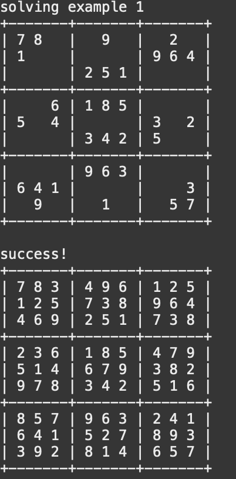
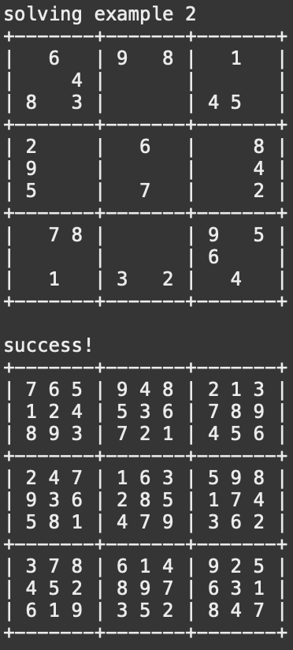
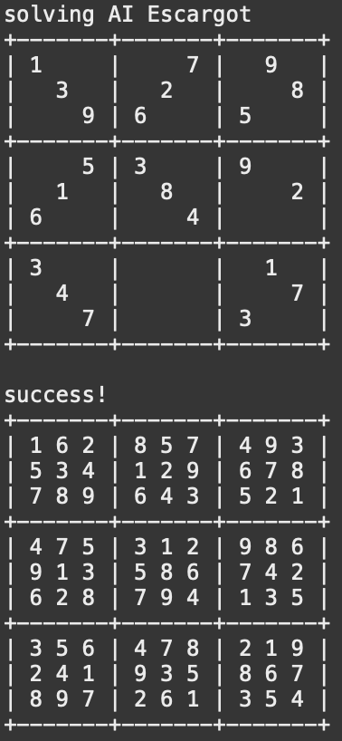

<div align="center" class="text-center p-4">
  
  
  
</div>

As part of one of my assignments in ICS 211, I had to create a sudoku-solving algorithm that uses recursion to fill each square and complete the puzzle. In the 3rd image above to the furthest right, you can see that particular puzzle's name is "AI Escargot", which is a famous sudoku problem that can only be solved by a computer due to how much computational retracing and backward steps are required to solve it, such that is it considered impossible for humans.

Here is some code that illustrates the main acting function of the algorithm that runs itself recursively to test all possible inputs for the indexes in each row and column:

```
public static boolean fillSudoku(int[][] sudoku) {

    boolean allFilled = true;
    int row = -1;
    int col = -1;

    for (int i = 0; i < sudoku.length; i++) {
      for (int j = 0; j < sudoku.length; j++) {
        if (sudoku[i][j] == 0) {
          row = i;
          col = j;
          allFilled = false;
          break;
        }
      }
      if (!allFilled) {
        break;
      }
    }
    if (allFilled) {
      return true;
    }

    for (int num = 1; num <= sudoku.length; num++) {
      sudoku[row][col] = num;
      if (checkSudoku(sudoku, true)) {
        if (fillSudoku(sudoku)) {
          return true;
        }
      }
    }

    sudoku[row][col] = 0;
    return false;
  }
```
It uses the helper function checkSudoku to determine if that number for the selected position is a valid input, and if so, continues the recursion. Otherwise, it does not and the program continues to recursively run itself through every number in every possible square of the puzzle, eventually landing on a solution assuming the puzzle was possible in the first place.
