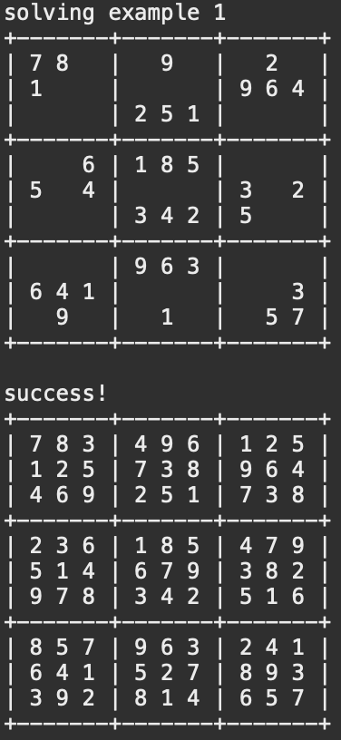

<div align="center" class="text-center p-4">
  
  
  
</div>

## My Struggle with ICS 211

When I initially transferred to UH Manoa from UH Maui College, I decided prior that I was going to transfer from my previously sought-after major in Finance to a more exciting and difficult major in Computer Science. I took my initial starting class for ICS at UH, ICS 111, at UH Maui College, and foolishly believed that my knowledge and experience in that class would transfer over with me into my next semester taking ICS 211 at UH Manoa. I was very wrong.

While ICS 111 at UHMC started us off in C++ using imperative programming methods, ICS 211 at UH Manoa was continuing Object-Oriented Programming in Java from the previous semester. I was completely unprepared for this as I had no clue what objects were, nor the syntax of Java or how to use check style in Eclipse. I ended up falling very behind in the first few weeks and had to drop the class. I then retook it in a future semester, however, prior to doing so, spent around 40 total hours over the break teaching myself Java and OOP to prepare myself. In the end, it worked out better than I anticipated, and this sudoku project was one of my creations for an assignment in the course.

## AI Escargot Algorithm

This sudoku project is a sudoku-solving algorithm that uses recursion to fill each square and complete the puzzle. In the 3rd image above to the furthest right, you can see that particular puzzle's name is "AI Escargot", which is a famous sudoku problem that can only be solved by a computer due to how much computational retracing and backward steps are required to solve it, such that is it considered impossible for humans.

Here is some code that illustrates the main acting function of the algorithm that runs itself recursively to test all possible inputs for the indexes in each row and column:

```
public static boolean fillSudoku(int[][] sudoku) {

    boolean allFilled = true;
    int row = -1;
    int col = -1;

    for (int i = 0; i < sudoku.length; i++) {
      for (int j = 0; j < sudoku.length; j++) {
        if (sudoku[i][j] == 0) {
          row = i;
          col = j;
          allFilled = false;
          break;
        }
      }
      if (!allFilled) {
        break;
      }
    }
    if (allFilled) {
      return true;
    }

    for (int num = 1; num <= sudoku.length; num++) {
      sudoku[row][col] = num;
      if (checkSudoku(sudoku, true)) {
        if (fillSudoku(sudoku)) {
          return true;
        }
      }
    }

    sudoku[row][col] = 0;
    return false;
  }
```
It uses the helper function checkSudoku to determine if that number for the selected position is a valid input, and if so, continues the recursion. Otherwise, it does not and the program continues to recursively run itself through every number in every possible square of the puzzle, eventually landing on a solution assuming the puzzle was possible in the first place. Both at the beginning and the end, a function prints out the sudokus in an easy-to-read visual image created with hyphens, vertical bars, and addition signs, using loops to fill in the spaces in-between with the numbers in the sudoku.

## What I've Learned

To give credit where it is due, both my classmates and I had a sufficient amount of help from the TA of my section as well as the professor, and without them, this process would have been much more difficult. Most of all, learning how to come to a superior for assistance with a project in the correct manner was the largest thing I took away from this project overall. While this is not the largest or most impressive project I have completed so far or will ever complete, I am still proud of the result as it was the very first coding project I had ever done. Finally figuring things out and ending up with a working product made me feel a sense of euphoria I hope to keep experiencing throughout every completion of an issue or project in my future computer science career.
