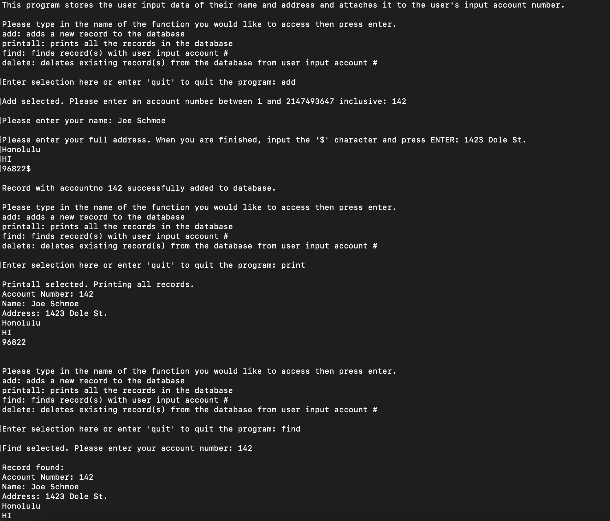

## What Do You Do When Fears Come True

The image above shows the running result of a database project I developed in my ICS 212 course at UH Manoa. Coming into this class, I was worried that the rumors surrounding the class and its professor would come true. The common sentiment among most ICS majors at UH Manoa who have taken ICS 212 with this particular professor is that while the class can teach you a lot, the grading and exams are also very harsh meaning a good portion of the students taking the class end up having to retake it another semester. It turns out, this sentiment was right on point.

I was struggling throughout the semester with this course. Between the gotcha questions on the quizzes before the 2.5-hour-long lectures at 6 pm to the several hour-long assignments due weekly on Friday nights, I had my work cut out for me while keeping up with the workload from my other classes. Among these several hour-long assignments was a multiple-week-long project for creating an address database using the Vi code editor in the Unix operating system.

## The Address Database Creation Process

This database project was created in 2 separate phases:

The first phase consisted of code written entirely in C and also split into two parts. Part 1 was creating the front end of the database by creating a user interface with sufficient input validation and allowing it to communicate back and forth with the database file itself. Part 2 was creating said database file using structs to hold the data and a text file to read and write on for the database itself.

The second phase was taking this code and rewriting it in C++ using a linked list class to hold the data as well as read and write it to a text file for the database itself. The user interface was also rewritten in C++ with some minor improvements. Below is an example of the linked list class' addRecord function, which took an account number and 2 arrays of characters, one for their name and one for their address, and stored it in a linked list node.

```
int llist::addRecord(int accNum, char name[], char address[])
{
    #if DEBUG_MODE
        std::cout << "\nThe addRecord function from llist.cpp was called with parameters:\n";
        std::cout << "Account number: " << accNum << "\n";
        std::cout << "Name: " << name << "\n";
        std::cout << "Address: " << address << "\n";
    #endif

    record* newRecord;

    if (start == NULL)
    {
        newRecord = new record;
        strcpy(newRecord->address, address);
        strcpy(newRecord->name, name);
        newRecord->accountno = accNum;
        newRecord->next = NULL;
        start = newRecord;

        return 0;
    }
    else
    {
        record* temp = start;
        record* prev = NULL;

        while (temp != NULL && accNum <= temp->accountno)
        {
            if (accNum == temp->accountno)
                return -1;
            prev = temp;
            temp = temp->next;
        }

        newRecord = new record;
        strcpy(newRecord->address, address);
        strcpy(newRecord->name, name);
        newRecord->accountno = accNum;

        if (prev == NULL)
        {
            newRecord->next = temp;
            start = newRecord;
            return 0;
        }
        else if (temp == NULL)
        {
            newRecord->next = NULL;
            prev->next = newRecord;
            return 0;
        }
        else
        {
            newRecord->next = temp;
            prev->next = newRecord;
            return 0;
        }
    }
}
```

## Do I Have Any Regrets?

This was one of my favorite projects that I have created so far in my computer science journey at UH Manoa. It has helped me to learn a lot about C, C++, classes, Unix, text-based IDEs, command line arguments, how memory works in computers, and several other key topics that are important for having a strong well of knowledge relating to the field. While it was an extremely stressful course and cost me my sanity at some times during the semester, I would still take it again. The knowledge and experience I've gained in this class far outweighed the stress of it all, and this address database project is my masterpiece that I have to show for it. A masterpiece to me, at least.

