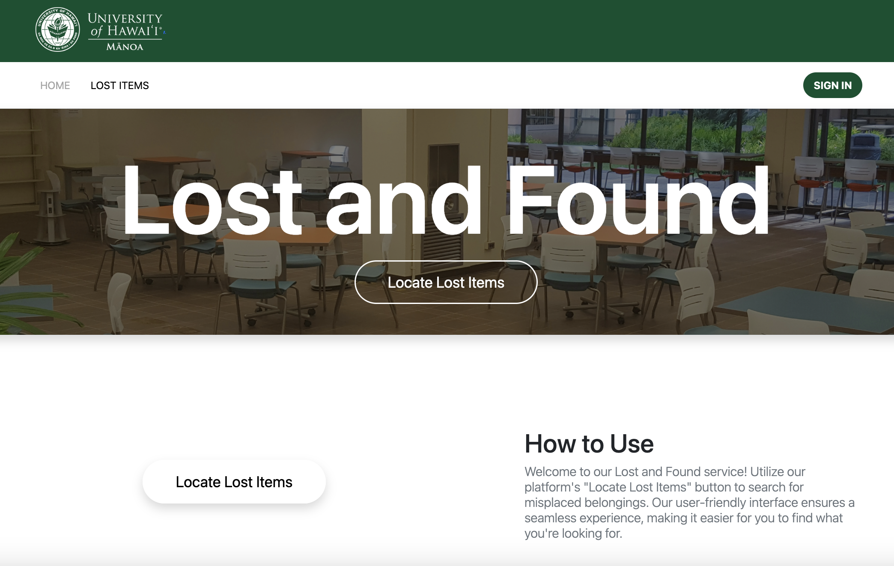
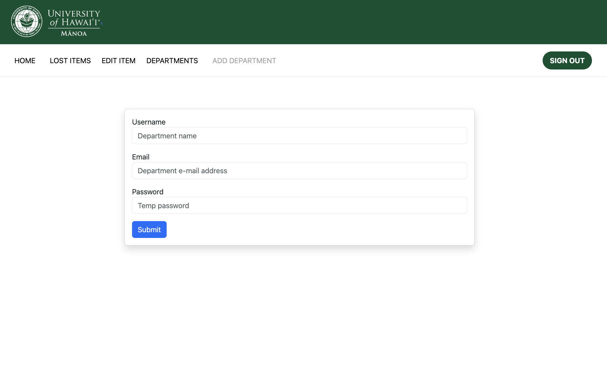
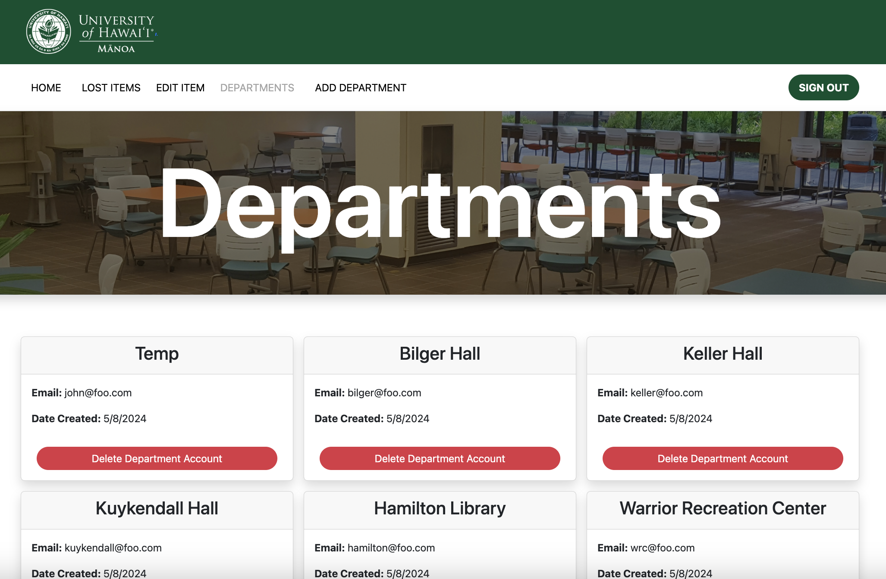

## Project Overview

This project was a group effort for our final project for our ICS 314 course at UH Manoa. My groupmates and I were assigned a project of our choosing to create a mock website for, and we chose to do a mock lost and found database for the UH Manoa campus. Normally groups choose from a set of pre-existing mock project ideas and are assigned to one of those, but the professors gave every group the opportunity to come up with a mock project idea of their own that had the chance of being selected as a future mock project template in future semesters of the course. Our table was the one that created the mock project idea of the lost and found database, so when we discovered that it was chosen as one of the possible templates, our group jumped on the opportunity to create it for our final project.

To give a simple explanation of what the website does, it allows departments of buildings on the UH Manoa campus to create, edit, and remove lost items on a database that is made of all the lost items of every department. Departments, however, can only edit and remove lost items that they have created, so it allows a fully functional database of all lost items across campus. An overarching admin account also oversees the department accounts and creates/removes accounts whenever deemed necessary. It also allows any generic student or user who is not a department or admin to look at the entire database and find an item they may have lost. While in the end, our mock project was not able to fully implement any sort of contact function or other quality-of-life features of the website, we were able to create a nice mock version that acts as a skeleton/template for future development.

## Individual Contributions

As for my own personal work on the project, I was in charge of most of the backend database work for the project. This meant creating the components that managed the MongoDB collections, creating Meteor methods that allowed actions such as the addition or deletion of accounts by an admin on the server side, creating the placeholder map component in each lost item's placeholder modal (we did not get far enough in development to fully implement these things). While I did work on some of the front end such as the admin department account management pages, most of the front end was worked on by my groupmates. Below you can see an example of the Meteor methods I created to add and remove department accounts from the database:

```
const addDepartment = 'addDepartmentMethod';

if (Meteor.isServer) {
  Meteor.methods({
    'addDepartmentMethod'({ username, email, password }) {
      const userID = Accounts.createUser({
        username: username,
        email: email,
        password: password,
      });
      Roles.createRole('department', { unlessExists: true });
      Roles.addUsersToRoles(userID, 'department');
    },
  });
}

const deleteDepartment = 'deleteDepartmentMethod';

if (Meteor.isServer) {
  Meteor.methods({
    // ES Lint disable line needed since the passed in argument is not an object and does not work if passed in as one
    // eslint-disable-next-line meteor/audit-argument-checks
    'deleteDepartmentMethod'(userID) {
      if (Roles.userIsInRole(Meteor.userId(), 'admin') && Meteor.userId() !== userID) {
        Meteor.users.remove({ _id: userID });
        return true;
      }
      return false;
    },
  });
}
```

These methods are used for the AddDepartment and ListDepartments pages respectively, as you can see in the screenshots below:

<div align="center" class="text-center p-4">
  
  
</div>

## Final Thoughts

Overall, I really enjoyed working on this project, as I have never really done any sort of large software development project so far, especially while working with other people. It made me realize how fun just creating things can sometimes be, and I'm honestly excited to continue working on this mock website even after this current semester is over and into the Summer break. 
